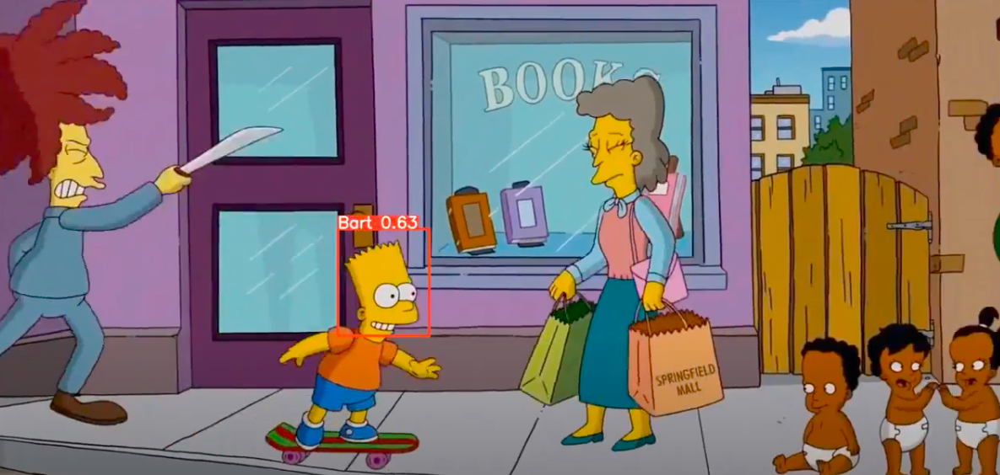

# Computer-Vision

This project consisted of detecting Bart Simpson's face. For this purpose, [Yolov5](https://github.com/ultralytics/yolov5) and [Google Colab](https://colab.research.google.com/notebooks/intro.ipynb?utm_source=scs-index) have been used..

This repository consists of the following files:

- YOLOv5_B.Simpson.ipynb 
	Notebook where the python code is collected
- train_data.zip
	File containing a sample of the images used to train the detection model and their respective coordinates with the labels.
- custom_data.yaml
	File where the name of each label is collected.
- simpson-intro.mp4
	verification video
- simpsons-intro-labels.mp4
	verification video showing the detection of the objects together with their label and probability.

